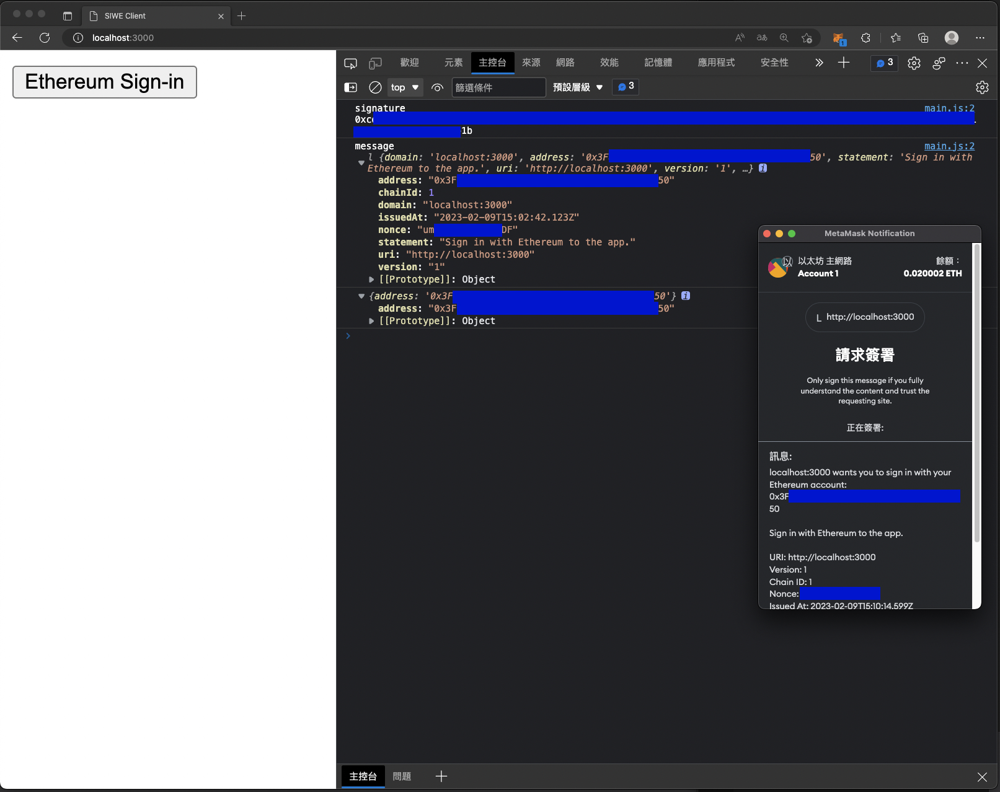

## Description

Sign-in With Ethereum (SIWE) example for NestJS.

## Installation and build client bundle

```bash
$ npm install
$ npm run build:client
```

## Running the app

```bash
$ npm run start
```

## Endpoints

- `/api/auth/challenge`: generate nonce value to prevent replay attack
- `/api/auth/login`: login as SIWE message and signature

## Frontend

open http://localhost:3000/ to access the sample page and click the "Ethereum Sign-in" button to login



## License

Nest is [MIT licensed](LICENSE).
